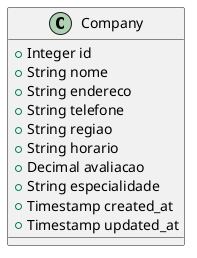
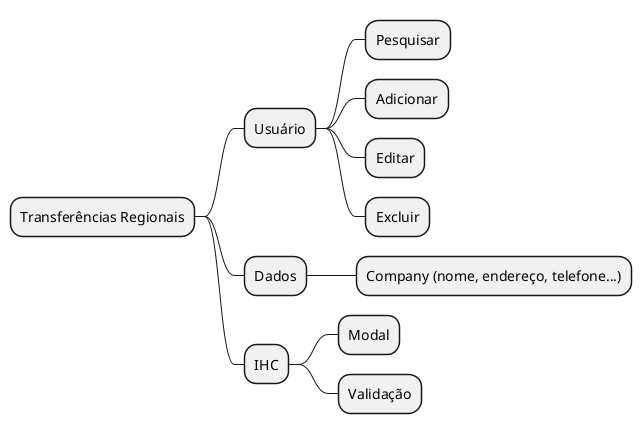

Projeto Integrador Transdisciplinar em Engenharia de Software I I - Turma_001
#Transferências Regionais  

README ACADÊMICO (EVIDÊNCIAS, PASSOS, MAPAS CONCEITUAIS)

Curso: Engenharia de Software II  
Unidade: [Turma 001] — Kaizen / Revisão de Planejamento  
Disciplina: Projeto Integrador Transdisciplinar  
Aluno: [Edson aragao da silva ] — github edsondeveloperfull-sudo  / transfer-regional-enhanced
Data: 10/11/2025

---

Índice
1. Introdução e objetivo do README
2. Síntese das ações Kaizen (melhoria contínua)
3. Escopo revisado (funcional / não-funcional)
4. Artefatos de modelagem (UML) e como visualizar
5. IHC — alterações no protótipo / mensagens de erro / acessibilidade
6. Projeto de dados (conceitual, lógico, físico) e Dicionário de Dados
7. Script / passos para gerar evidências (passo-a-passo + prints)
8. Mapas conceituais e diagramas (instruções + PlantUML)
9. Checklist de entrega acadêmica
10. Anexos e localização dos arquivos no repositório

---

1. Introdução e objetivo do README
Este README acadêmico documenta a revisão planejada (Kaizen) do projeto “Transferências Regionais”. Contém:
- os ajustes de escopo e justificativas;
- as melhorias na modelagem UML e no projeto de dados;
- as mudanças de IHC (telas, validações, mensagens);
- scripts e instruções passo-a-passo para gerar as evidências (prints, diagramas);
- o dicionário de dados e o script SQL para implantação física do banco.

Use este documento como guia para anexar evidências no repositório do Projeto Integrador.

---

2. Síntese das ações Kaizen (melhoria contínua)
Resumo das decisões e melhorias aplicadas nesta iteração:
- Decisão de prototipagem: persistência local (localStorage) para iteração 1; migrar para BD relacional na iteração 2.
- IHC: inclusão de validação inline, aria-live para notificações, foco controlado em modais, rótulos e placeholders claros.
- Modelagem: criação da tabela `companies`, inclusão de índices (região, avaliação) e constraint de avaliação (0–5).
- Testes rápidos: cenários de CRUD validados manualmente no protótipo (adicionar, editar, excluir, filtrar).
- Documentação: inclusão de diagramas PlantUML e dicionário de dados (DATA_DICTIONARY.md).

Justificativa: pequenas correções e melhorias aumentam a acurácia do projeto, reduzem retrabalhos na implantação e fornecem evidências objetivas para avaliação.

---

3. Escopo revisado
3.1 Escopo funcional (iteração 1 — protótipo)
- Visualização em grid de empresas com detalhes.
- Filtros por região e busca por nome / especialidade.
- CRUD básico em memória (Adicionar, Editar, Excluir).
- Estatísticas rápidas (total, avaliação média, operando 24h).
- Formulário com validação e mensagens de erro.

3.2 Escopo de evolução (iterações futuras)
- Persistência em banco (API RESTful).
- Autenticação/Autorização (papéis: admin / editor).
- Histórico de avaliações e múltiplos endereços por empresa.
- Integração com mapas (Google Maps / Leaflet) e geocoding.
- Testes automatizados e CI/CD.

3.3 Requisitos não-funcionais (NFR)
- Acessibilidade (WCAG básico: labels, aria-live, foco).
- Responsividade (mobile-first).
- Performance: paginação ou lazy-loading quando > 200 registros.
- Segurança: validação no backend e proteção contra XSS/CSRF.

---

4. Artefatos de modelagem (UML)
Arquivos incluídos:
- `UML/company.puml` — diagrama de classes (entidade Company).
- Recomenda-se gerar:
  - Diagrama de sequência: "Adicionar Empresa" (UI → Controller → Service → Repository → DB).
  - Diagrama de atividades: fluxo de validação do formulário.

Como visualizar PlantUML localmente:
- Instale PlantUML (ou use extensão PlantUML no VS Code).
- Exemplo de comando (requere Java e plantuml.jar):
  java -jar plantuml.jar UML/company.puml
- No VS Code abra o arquivo `.puml` e visualize com a extensão PlantUML.

Exemplo (trecho) do arquivo `UML/company.puml`:


---

5. IHC — alterações e evidências de protótipo
5.1 Melhorias realizadas
- Modal de adicionar/editar com atributos `aria-*`, `novalidate` no form e feedback inline.
- Mensagens de erro específicas por campo (ex.: "Formato de telefone inválido (ex: (11) 99999-9999)").
- Notificação de operações com `aria-live` para leitores de tela.
- Foco automático no primeiro input do modal ao abrir.
- `type="button"` em botões que não são submit para evitar submit indesejado.
- Evitar injeção: escape dos valores exibidos (função escapeHtml no front).

5.2 Protótipos e telas
Arquivos esperados no repositório:
- `assets/screenshots/01_home.png` — tela principal com grid
- `assets/screenshots/02_modal_add.png` — modal com formulário vazio
- `assets/screenshots/03_error_validation.png` — exemplo de validação em campo telefone
- `assets/screenshots/04_edit.png` — modal pré-preenchido editando empresa

Como gerar os prints (passos):
1. Abra `index.html` no navegador (duplo clique ou servidor local).
2. Navegue até a tela inicial.
3. Abrir modal `Nova Empresa` e faça captura (salve em `assets/screenshots/02_modal_add.png`).
4. Submeta com campo telefone inválido para capturar a mensagem de erro (salve em `03_error_validation.png`).
5. Edite um registro e capture (salve em `04_edit.png`).

Observação: inclua as imagens no repositório em `assets/screenshots/` e referencie-as neste README.

---

6. Projeto de dados e Dicionário
6.1 Modelo Conceitual
- Entidade principal: Company
- Atributos: id, nome, endereco, telefone, regiao, horario, avaliacao, especialidade, created_at, updated_at

6.2 Modelo Lógico / Normalização
- Por enquanto 1NF/2NF suficiente (as informações estão em uma única tabela). Para normalizar:
  - company_addresses (se múltiplos endereços)
  - company_ratings (histórico de avaliações)
  - regions (tabela de regiões se for necessário padronizar)

6.3 Script SQL de criação (arquivo: `db/schema.sql`)
Trecho:
```sql
CREATE TABLE companies (
  id SERIAL PRIMARY KEY,
  nome VARCHAR(255) NOT NULL,
  endereco VARCHAR(500) NOT NULL,
  telefone VARCHAR(20) NOT NULL,
  regiao VARCHAR(50) NOT NULL,
  horario VARCHAR(100) NOT NULL,
  avaliacao NUMERIC(2,1) NOT NULL CHECK (avaliacao >= 0 AND avaliacao <= 5),
  especialidade VARCHAR(255) NOT NULL,
  created_at TIMESTAMP WITH TIME ZONE DEFAULT now(),
  updated_at TIMESTAMP WITH TIME ZONE DEFAULT now()
);

CREATE INDEX idx_companies_regiao ON companies (regiao);
CREATE INDEX idx_companies_avaliacao ON companies (avaliacao);
```

6.4 Dicionário de Dados
Arquivo: `DATA_DICTIONARY.md` (incluído no repositório) — contém descrição detalhada por atributo (tipo, tamanho, obrigatoriedade e observações).

---

7. Passos para gerar EVIDÊNCIAS (passo-a-passo)
Abaixo os passos que você deve executar ao preparar o pacote acadêmico (screenshots + descrições):

Preparação
- Garanta que o repositório contenha:
  - `index.html`
  - `assets/css/styles.css`
  - `assets/js/app.js` (com persistência via localStorage e validação)
  - `db/schema.sql`
  - `DATA_DICTIONARY.md`
  - `UML/*.puml`
  - `assets/screenshots/` (imagens geradas)
  - `docs/` (opcional: mapas conceituais)
- Recomendado: usar o script `create_zip.sh` ou `create_zip.ps1` para gerar o ZIP a ser anexado.

Evidências (sugestão de sequência e nomes de arquivos)
1. Inicialização (com os dados padrão)  
   - Ação: abrir `index.html` → visualizar grid com registros.  
   - Print: `assets/screenshots/01_home.png`  
   - Texto explicativo: "Tela inicial com N registros; filtros disponíveis."

2. Adicionar empresa — fluxo nominal  
   - Ação: clicar "Nova Empresa", preencher todos campos válidos, salvar.  
   - Print: `assets/screenshots/02_add_success.png`  
   - Texto: "Empresa adicionada com sucesso; localStorage atualizado."

3. Validação — erro de formato  
   - Ação: no modal inserir telefone inválido, tentar salvar.  
   - Print: `assets/screenshots/03_error_validation.png`  
   - Texto: "Validação apresenta erro no campo telefone com mensagem clara."

4. Editar empresa  
   - Ação: clicar editar em um registro, alterar campo, salvar.  
   - Print: `assets/screenshots/04_edit.png`  
   - Texto: "Fluxo de edição funciona, dados atualizados."

5. Excluir empresa  
   - Ação: clicar excluir e confirmar.  
   - Print: `assets/screenshots/05_delete_confirm.png`  
   - Texto: "Fluxo de exclusão e confirmação."

6. Estatísticas atualizadas  
   - Ação: após operações, observar cards (total/avg/open24).  
   - Print: `assets/screenshots/06_stats.png`  
   - Texto: "Estatísticas refletem os dados atuais."

7. Diagramas e dicionário  
   - Anexos: `UML/company.puml`, `db/schema.sql`, `DATA_DICTIONARY.md`

Para cada print inclua no repositório um breve parágrafo no README indicando: data, passo executado, navegador/versão, ambiente (SO), e comentário sobre o que o print comprova.

---

8. Mapas conceituais e diagramas (instruções)
8.1 Mapas conceituais
- Recomendo criar um mapa conceitual (ferramentas: draw.io, CmapTools, Figma) com: atores, funcionalidades, fluxos e entidades.
- Salve como `docs/concept-map.png` e inclua link para versão editável (`docs/concept-map.drawio`).

8.2 Exemplo rápido de mapa conceitual em PlantUML (mindmap plugin)

(Gere a imagem com PlantUML que suporte mindmap).

---

9. Checklist de submissão acadêmica
Antes de anexar o trabalho ao ambiente acadêmico (Moodle / AVA / repositório):
- [ ] README_ACADEMICO.md (este arquivo) atualizado com seu nome e matrícula.
- [ ] index.html funcionando com assets.
- [ ] `assets/js/app.js` e `assets/css/styles.css` (separados).
- [ ] `db/schema.sql` e `DATA_DICTIONARY.md`.
- [ ] `UML/*.puml` e diagramas exportados (`.png`).
- [ ] `assets/screenshots/*` contendo ao menos os 6 prints listados.
- [ ] `docs/concept-map.png` (mapa conceitual).
- [ ] ZIP final (opcional): `transferencias-regionais-academico.zip` conterá todos os itens acima.
- [ ] Pequeno relatório (1-2 páginas) descrevendo decisões Kaizen e roadmap de evolução.

---

10. Anexos e localização dos arquivos no repositório
Estrutura sugerida do repositório para submissão:
```
/ (root)
|-- index.html
|-- README.md             (README técnico do projeto)
|-- README_ACADEMICO.md   (este arquivo)
|-- DATA_DICTIONARY.md
|-- db/
|   |-- schema.sql
|-- UML/
|   |-- company.puml
|   |-- sequence_add_company.puml       (opcional)
|-- assets/
|   |-- css/
|   |   |-- styles.css
|   |-- js/
|   |   |-- app.js
|   |-- screenshots/
|       |-- 01_home.png
|       |-- 02_add_success.png
|       |-- 03_error_validation.png
|       |-- 04_edit.png
|       |-- 05_delete_confirm.png
|       |-- 06_stats.png
|-- docs/
|   |-- concept-map.png
|-- LICENSE
```


- Este README foi elaborado para ser anexado diretamente à entrega do Projeto Integrador, contendo evidências práticas e críticas das decisões de modelagem e IHC.
